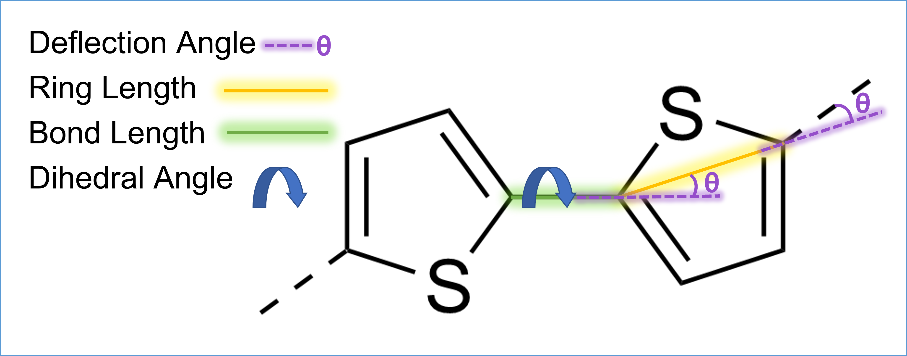
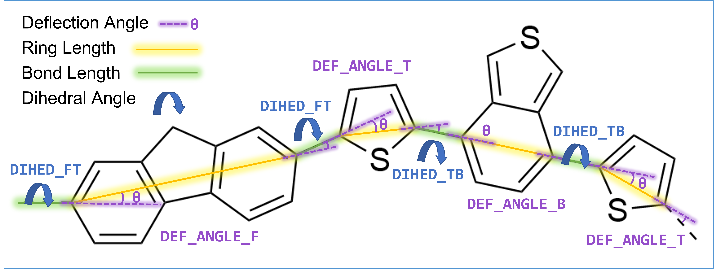

# PolyRot
This repo contains various tools for manipulating and rotating polymers. The tools fall into three 
categories: 
* `chain_dimensions`: a tools for analytically estimating chain dimensions using the dihedral potential 
energy surfaces. 
* `central_dihedral`: tools for finding and rotating the central dihedral angle of a polymer (adapted from
https://doi.org/10.1021/ma500923r)
* `polymer_data`: a module for calculating polymer properties from a collection of master `json` files 

# Installation 
This module can be installed with `pip install` by running the following code:
```bash
pip install git+https://github.com/rduke199/PolyRot.git
```

# Modules 
## Chain Dimensions

### Generating polymers

The first step in using this tool is collecting the necessary data. Consider the following polymer: 



The PolymerRotate class requires four types of data, each one a list: 
1. List of ring lengths (`float`)
2. List of bond lengths (`float`)
3. List of deflection angles lengths (`float`), in degrees if `theta_degrees` is True (default)
4. List of dihedral angles' potential energy surfaces (`list` of `tuples` where each tuple has the format 
(`degree`, `energy`)), in degrees if `theta_degrees` is True (default)
```python
DIHED_ROT = [(0, 0), (10, 0.293835), (20, 0.967939), (30, 1.86645),
                 (40, 3.177), (50, 4.91823), (60, 6.91593), (70, 8.91844), (80, 10.5465),
                 (90, 11.4081), (100, 11.2003), (110, 10.0682), (120, 8.36782), (130, 6.51926),
                 (140, 5.079767), (150, 4.36963), (160, 4.04486), (170, 3.80474), (180, 3.82803)]
L_RING = 2.548  # length of the ring tangent
L_BOND = 1.480  # length of the inter-moiety bond
DEFLECTION = 15  # degrees
```


With the specified data, the user can define a polymer object.

```python
from PolyRot.chain_dimensions import PolymerRotate

polymer = PolymerRotate(ring_lengths=[L_RING, L_RING], 
                        bond_lengths=[L_BOND, L_BOND],
                        deflection_angles=[  DEFLECTION, -DEFLECTION, 
                                            -DEFLECTION,  DEFLECTION],
                        dihed_energies=[DIHED_ROT, DIHED_ROT])
```

One a polymer object has been defined, the rest becomes very straightforward. Here we generate a polymer with 
50 rings. The `std_chain` function always builds a polymer with alternating angles. We then use the `draw_chain` 
function to draw the resulting chain in two dimensions.  
```python
from PolyRot.chain_dimensions import draw_chain

ch = polymer.std_chain(50)
draw_chain(ch, dim3=False)
```

Next we can randomly rotate the dihedral angles for the polymer. Each angle is rotated randomly, but weighted
according to the potential energy surface given when defining the polymer. 
We also plot the rotated polymer, in three dimensions this time. 
```python
new_ch = polymer.rotated_chain(50)
draw_chain(new_ch, dim3=True)
```

### Analysis: predicting chain dimensions 

To estimate the chain dimensions for our polymer, we first generate 10,000 iterations of the randomly rotated
polymer 
```python
polymers_many = multi_polymer(polymer, n=50, num_poly=100)
```

Next, we find the tangent-tangent correlation of the first ring with each subsequent ring. For a polymer
chain with any stiffness, the tangent-tangent correlation should be correlated (often linearly) with the 
distance of a ring from the first ring. 
We can view results of tangent-tangent correlation function by specifying `plot=Ture`. 
The slope of the tangent-tangent correlation vs distance estimates the persistence length 
(N<sub>p</sub>). Finally we can estimate the mean square end-to-end distance (R<sup>2</sup>) 
for our polymer as shown below.
```python
from PolyRot.chain_dimensions import n_p, avg_r_2

n_p_value = n_p(polymers_many, plot=True)

r_2_value = avg_r_2(polymers_many, in_nm_2=True)
```

### More complex polymers 
This same process can be completed for more complex polymers. The only part that become more difficult 
with more complex polymers is the initial creation of a polymer object. For example, consider the 
following polymer: 


The measurements for this polymer are as follows.

```python
# Dihedral energy surface between thiophene and benzothiadiazole
DIHED_TB = {(180, 0.551967), (170, 0.557568), (160, 0.57842), (150, 0.743988),
           (140, 1.15127), (130, 1.76722), (120, 2.48711), (110, 3.17616), (100, 3.6976),
           (90, 3.93171), (80, 3.8368), (70, 3.38603), (60, 2.66725), (50, 1.79179),
           (40, 0.954215), (30, 0.334189), (20, 0.0295074), (10, 0), (0, 0.00945115)}

# Dihedral energy surface between fluorene and thiophene
DIHED_FT = {(180, 0.496007), (170, 0.338429), (160, 0.0933325), (150, 0),
           (140, 0.17495), (130, 0.647714), (120, 1.29963), (110, 1.9583), (100, 2.45073),
           (90, 2.6726), (80, 2.55251), (70, 2.1469), (60, 1.56547), (50, 0.979727),
           (40, 0.572042), (30, 0.409372), (20, 0.469453), (10, 0.615015), (0, 0.652945)};

LR_F = 6.951  # length of C-C (across the fluorene)
LR_T = 2.540  # length of C-S-C (across thiophene ring)
LR_B = 2.967  # length of C-C (across the benzene of benzothiadizole)

LB_FT = 1.466  # length of C-C bond (between the the fluorene and thiophene)
LB_TB = 1.456  # length of C-C bond (between thiophene and benzothiadiazole)

DEF_ANGLE_F = 11  # degrees
DEF_ANGLE_T = 14  # degrees
DEF_ANGLE_B = 1.4  # degrees

```

Given this information, the polymer object would be defined as defined below.

```python
from PolyRot.chain_dimensions import PolymerRotate

polymer = PolymerRotate(
    ring_lengths=[LR_F, LR_T, LR_B, LR_T],
    bond_lengths=[LB_FT, LB_TB, LB_TB, LB_FT],
    deflection_angles=[ DEF_ANGLE_T,  DEF_ANGLE_F, DEF_ANGLE_F, -DEF_ANGLE_T, 
                       -DEF_ANGLE_T, -DEF_ANGLE_B,-DEF_ANGLE_B,  DEF_ANGLE_T],
    dihed_energies=[DIHED_FT, DIHED_TB, DIHED_TB, DIHED_FT]
)
```


## Default Measurements

Although it is recommended that users find exact chemical measurements via calculations or
literature review, users can find estimated measurements via the `default_measuements` module. 
For example, one might find the `PolymerRotate` parameters for example 1 as follows: 

```python
from PolyRot.default_measurements import *

L_RING = ring_length(ring_size=5) # length of the ring tangent
# >>> 2.4  
L_BOND = bond_length(atom1="C", atom2="C", bond_order=1.5) # length of the inter-moiety bond
# >>> 1.4
DEFLECTION = deflection_angle(ring_size=5) # degrees
# >>> 18
```

Recall that the true values are as shown below, so the `default_measuements` module provides 
only a rough estimate. 
```python
L_RING = 2.548  # length of the ring tangent
L_BOND = 1.480  # length of the inter-moiety bond
DEFLECTION = 15  # degrees
```

## Central Dihedral 
*In development*


## Polymer Data
*In development*
